# Efficient Algorithms for Linearly-Solvable Markov Decision Processes

As part of my Bachelor's Thesis, I conducted in-depth research on reinforcement learning (RL) algorithms, addressing their scalability and efficiency in large and complex domains. [This thesis](Efficient_Algorithms_for_LMDPs.pdf) explores the application of Linearly Solvable Markov Decision Processes (LMDPs) to tackle these challenges. A significant contribution of my work is the development of novel embedding techniques for creating precise and exact mappings between traditional MDPs and LMDPs. These techniques improve the approximation precision by 99.23% over the approach by Todorov, enabling robust and reliable comparisons across the two frameworks, regardless of the problem's definition or the nature of its dynamics.

This research evaluates and benchmarks the performance of traditional RL models against algorithms leveraging LMDPs, such as Z-learning, within an adaptable reinforcement learning framework. By implementing scalable and efficient versions of these algorithms, I provide a comprehensive comparison that highlights the advantages of LMDP-based approaches. Additionally, the thesis delves into various factors that enhance the decision-making capabilities of RL agents, such as algorithm design and exploration strategies, demonstrating the superiority of the LMDP framework in multiple settings. Moreover, I developed an RL simulator that provides a generalized implementation of MDP and LMDP frameworks. This simulator supports optimized core methods and seamless integration with repositories like Minigrid and Gymnasium, allowing researchers to easily extend and apply it to diverse problem definitions without the need to build custom solutions.

## Embedding Stochastic MDP into LMDPs

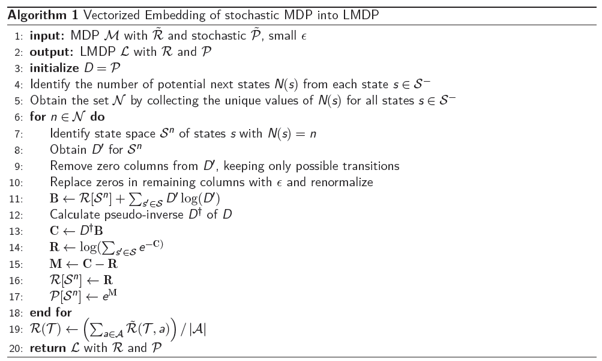

## Embedding Deterministic MDPs into LMDPs

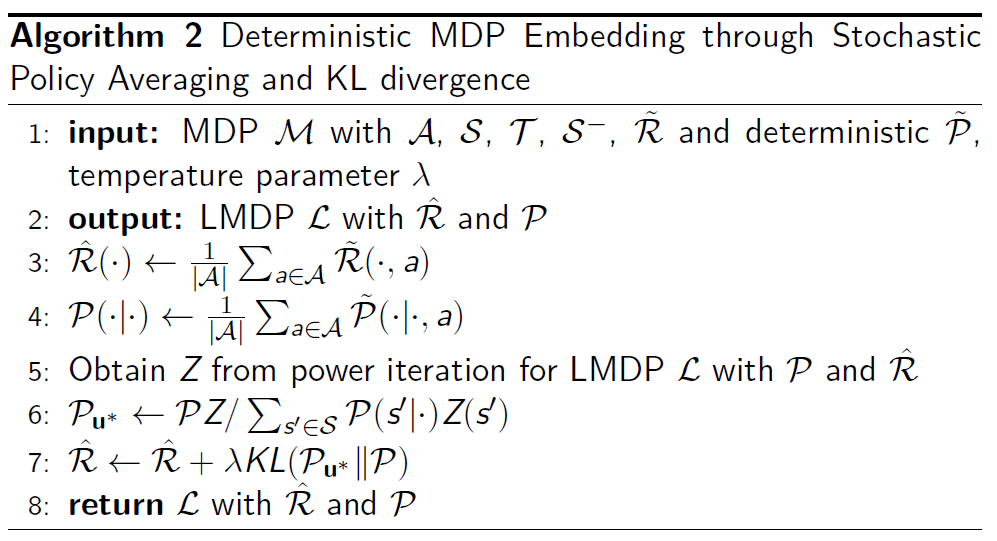

$$
\begin{aligned}
\min_{K \in \mathbb{R}} \quad \quad & \left\| \mathbf{v}_K - \mathbf{v}^* \right\|^2 \\
\text{subject to} \quad \quad & \mathbf{\mathcal{R}} = K \cdot \mathbf{\hat{\mathcal{R}}}, \\
& G_{ii} = e^{\mathcal{R}(s_i)/\lambda}, \quad \forall i \in \mathbb{N} \cap [1, |\mathcal{S}|], \\
& \mathbf{z}_K = G\mathcal{P}\mathbf{z}_K, \\
& \mathbf{v}_K = \lambda \log{\mathbf{z}_K}, \\
& \mathbf{v}^* = \max_{a} \left[ \tilde{\mathbf{R}}_a + \gamma \mathbf{\tilde{P}}_a \mathbf{v}^* \right].
\end{aligned}
$$

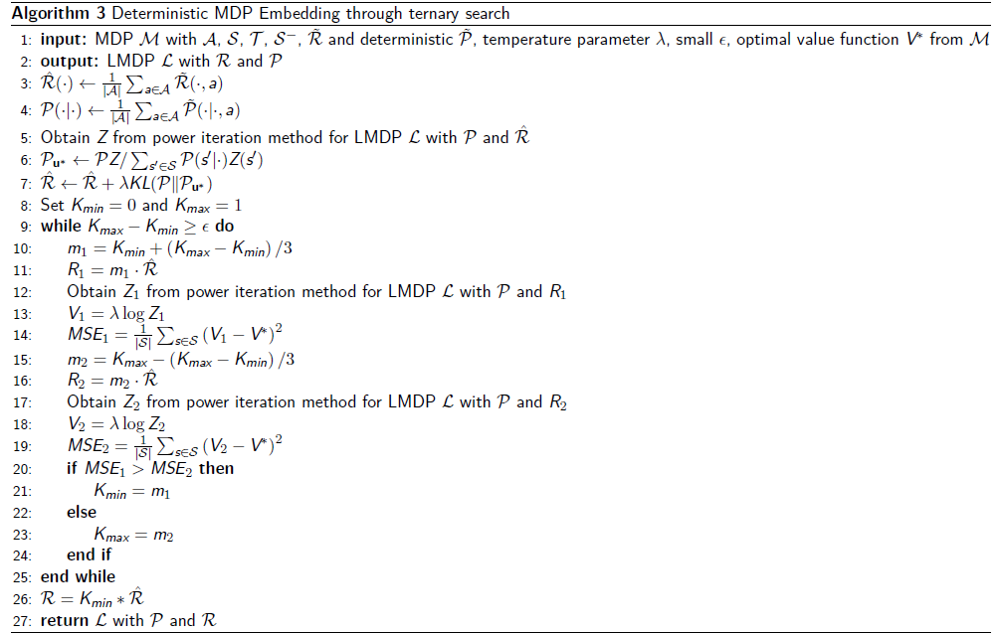

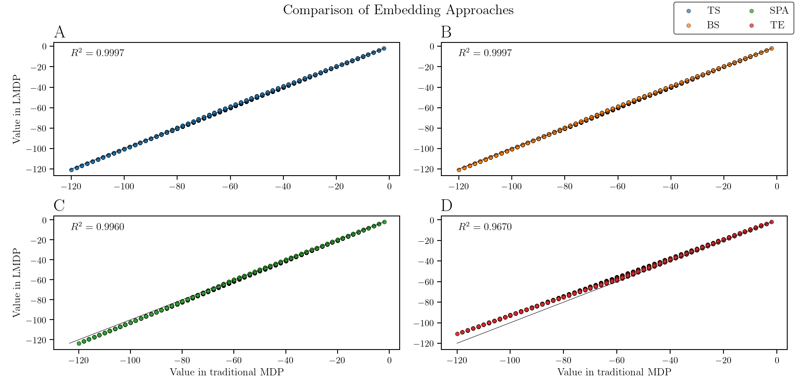

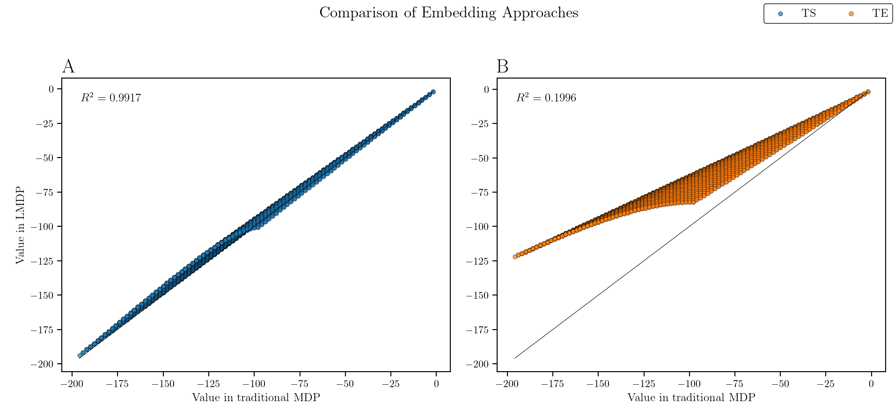

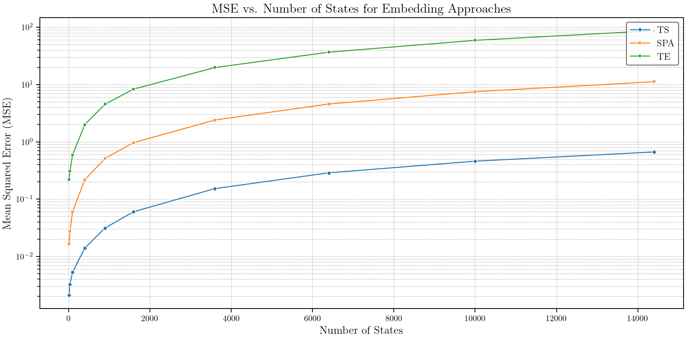

## Experimentation
### Exploration Strategies in Traditional MDPs

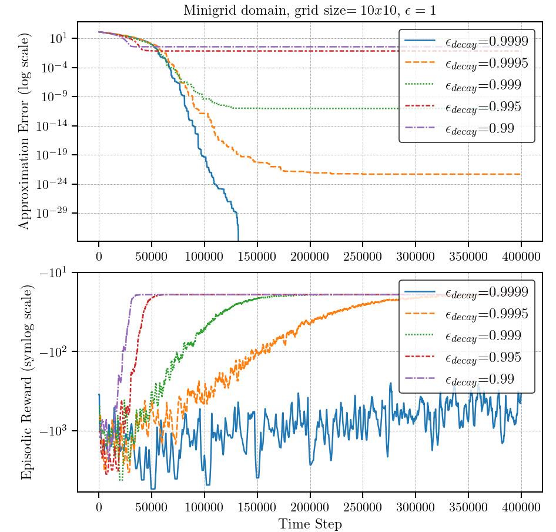

### Comparative Analysis of Z-learning and Q-learning
#### Approximation Error and Episodic Reward

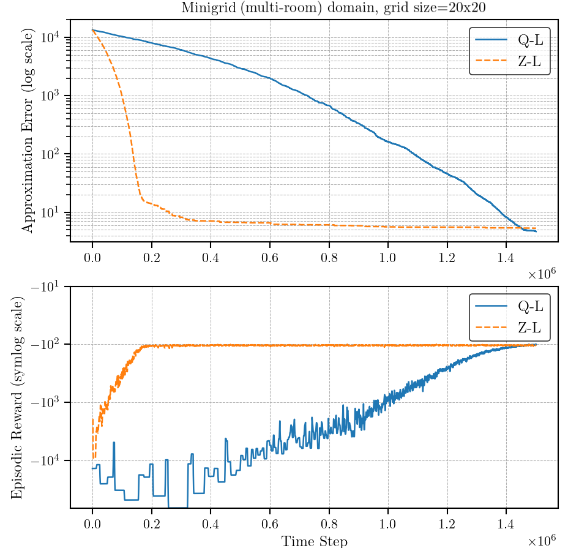

#### Value Function and Policy Approximations

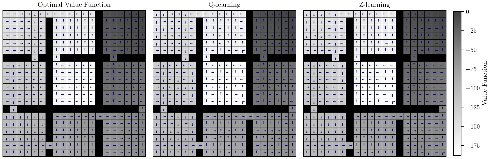

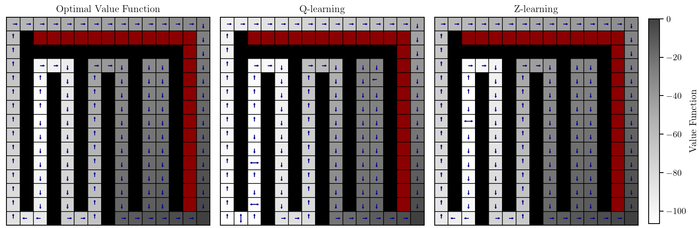

### Agent Solutions

<table>
  <tr>
    <td>
      
    </td>
    <td>
      
    </td>
    <td>
      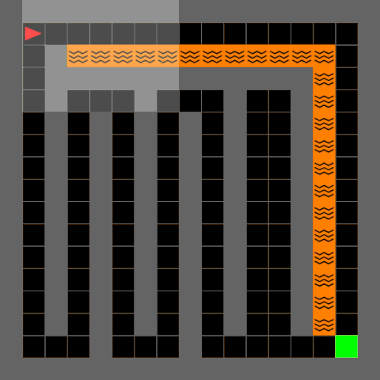
    </td>
    <td>
      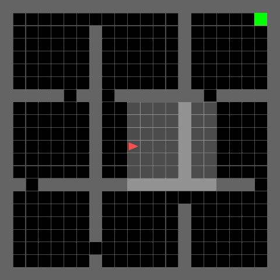
    </td>
  </tr>
</table>

## Requirements

The project requires the following Python libraries:

- `gym==0.26.2`
- `imageio==2.31.4`
- `matplotlib==3.8.0`
- `minigrid==2.3.1`
- `numpy==1.26.4`
- `scipy==1.12.0`

You can install these requirements using pip:

```bash
pip install -r requirements.txt
```

**Link to project webpage: https://davidperezcarrasco.github.io/projects/lmdps/**
