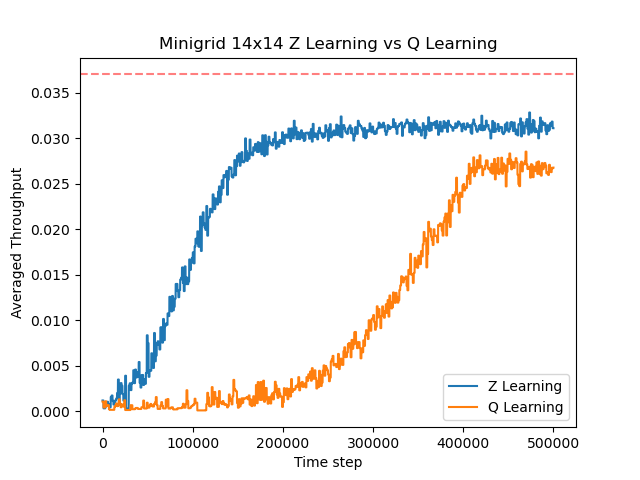

# Reinforcement Learning Simulator for Deterministic Actions and LMDP Benchmarking

Developed a simulator for deterministic actions in sequential decision-making problems and integrated it with popular reinforcement learning repositories. Multiple decision domains were designed and generated, enabling the implementation and comparison of cutting-edge reinforcement learning algorithms within the framework of Linearly-solvable Markov Decision Processes (LMDP). My thesis focuses on improving the performance and scalability of these algorithms in larger and more complex domains. This research involves finding efficient computational methods for optimal action selection and optimizing value function approximation within linear LMDPs.
Due to the ongoing research nature of this project within the UPF ML/AI Research group, the codebase is not currently publicly available. However, feel free to contact me for further details or potential future collaboration.

Some of the results are:

## Z-Learning vs Q-Learning Benchmarking

